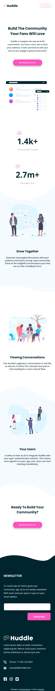

# Frontend Mentor - Huddle landing page with curved sections solution

This is a solution to the [Huddle landing page with curved sections challenge on Frontend Mentor](https://www.frontendmentor.io/challenges/huddle-landing-page-with-curved-sections-5ca5ecd01e82137ec91a50f2). Frontend Mentor challenges help you improve your coding skills by building realistic projects. 

## Table of contents

- [Overview](#overview)
  - [The challenge](#the-challenge)
  - [Screenshot](#screenshot)
  - [Links](#links)
- [My process](#my-process)
  - [Built with](#built-with)
  - [What I learned](#what-i-learned)
  - [Useful resources](#useful-resources)
- [Author](#author)

## Overview

### The challenge

Users should be able to:

- View the optimal layout for the site depending on their device's screen size
- See hover states for all interactive elements on the page

### Screenshot





### Links

- Solution URL: [solution URL](https://your-solution-url.com)
- Live Site URL: [live site URL](https://your-live-site-url.com)

## My process

### Built with

- Semantic HTML5 markup
- Flexbox
- js email validation

### What I learned

how to center images and text elements 

```css
picture img {
    display: block;
    margin: 0 auto 0 auto;}

.section1 p {
    text-align: center;
    width: 590px;
    margin: 0 auto 0 auto;
}
```

use html form elements
```html
<form onsubmit="return check()" novalidate>
  <input type="email" id="email" name="email" placeholder="">
  <input type="submit" class="submit" value="Subscribe">
  <div id="msg"></div>
</form>
```

js validation
```js
<script>
  function check () {
    var valid = true, error = "", field = "", validRegex ="[a-z0-9._%+-]+@[a-z0-9.-]+\.[a-z]{2,4}$";
    field = document.getElementById("email");
    error = document.getElementById("msg");
    if (!field.checkValidity() || !input.value.match(validRegex) || field.value == "") {
      valid = false;
      field.classList.add("err");
      error.innerHTML = "Check your email please";
    } else {
      field.classList.remove("err");
      error.innerHTML = "";
    } return valid;}
</script>
```


### Useful resources

- [Centering img & text](https://www.w3.org/Style/Examples/007/center.en.html#block) - This helped me to center text and images while their width is smaller than that of the page.


## Author

- Frontend Mentor - [@Amani_NFZ](https://www.frontendmentor.io/profile/nefzina)
